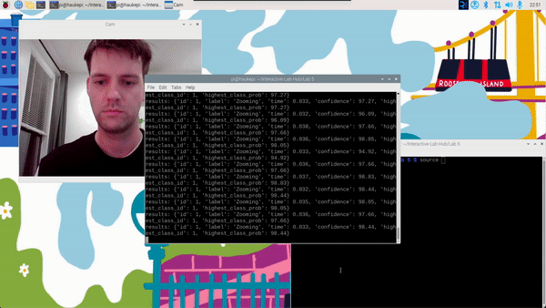

# Observant Systems

**NAMES OF COLLABORATORS HERE**

Benthan Vu (bv233)

<details>
	<summary><strong>Instructions</strong></summary>
For lab this week, we focus on creating interactive systems that can detect and respond to events or stimuli in the environment of the Pi, like the Boat Detector we mentioned in lecture. 
Your **observant device** could, for example, count items, find objects, recognize an event or continuously monitor a room.

This lab will help you think through the design of observant systems, particularly corner cases that the algorithms need to be aware of.

## Prep

1.  Install VNC on your laptop if you have not yet done so. This lab will actually require you to run script on your Pi through VNC so that you can see the video stream. Please refer to the [prep for Lab 2](https://github.com/FAR-Lab/Interactive-Lab-Hub/blob/-/Lab%202/prep.md#using-vnc-to-see-your-pi-desktop).
2.  Install the dependencies as described in the [prep document](prep.md). 
3.  Read about [OpenCV](https://opencv.org/about/),[Pytorch](https://pytorch.org/), [MediaPipe](https://mediapipe.dev/), and [TeachableMachines](https://teachablemachine.withgoogle.com/).
4.  Read Belloti, et al.'s [Making Sense of Sensing Systems: Five Questions for Designers and Researchers](https://www.cc.gatech.edu/~keith/pubs/chi2002-sensing.pdf).

### For the lab, you will need:
1. Pull the new Github Repo
1. Raspberry Pi
1. Webcam 

### Deliverables for this lab are:
1. Show pictures, videos of the "sense-making" algorithms you tried.
1. Show a video of how you embed one of these algorithms into your observant system.
1. Test, characterize your interactive device. Show faults in the detection and how the system handled it.

## Overview
Building upon the paper-airplane metaphor (we're understanding the material of machine learning for design), here are the four sections of the lab activity:

A) [Play](#part-a)

B) [Fold](#part-b)

C) [Flight test](#part-c)

D) [Reflect](#part-d)

---
</details>


### Part A
### Play with different sense-making algorithms.

#### Pytorch for object recognition

<details>
	<summary><strong>Instructions</strong></summary>
For this first demo, you will be using PyTorch and running a MobileNet v2 classification model in real time (30 fps+) on the CPU. We will be following steps adapted from [this tutorial](https://pytorch.org/tutorials/intermediate/realtime_rpi.html).


To get started, install dependencies into a virtual environment for this exercise as described in [prep.md](prep.md).

Make sure your webcam is connected.

You can check the installation by running:

```
python -c "import torch; print(torch.__version__)"
```

If everything is ok, you should be able to start doing object recognition. For this default example, we use [MobileNet_v2](https://arxiv.org/abs/1801.04381). This model is able to perform object recognition for 1000 object classes (check [classes.json](classes.json) to see which ones.

Start detection by running  

```
python infer.py
```

The first 2 inferences will be slower. Now, you can try placing several objects in front of the camera.

Read the `infer.py` script and become familiar with the code. You can change the video resolution and frames per second (FPS). You may also use the weights of the larger pre-trained mobilenet_v3_large model, as described [here](https://pytorch.org/tutorials/intermediate/realtime_rpi.html#model-choices).
</details>


### Pytorch Usage


#### More classes

<details>
	<summary><strong>Instructions</strong></summary>
[PyTorch supports transfer learning](https://pytorch.org/tutorials/beginner/transfer_learning_tutorial.html), so you can fine‑tune and transfer learn models to recognize your own objects. It requires extra steps, so we won't cover it here.

For more details on transfer learning and deployment to embedded devices, see Deep Learning on Embedded Systems: A Hands‑On Approach Using Jetson Nano and Raspberry Pi (Tariq M. Arif). [Chapter 10](https://onlinelibrary.wiley.com/doi/10.1002/9781394269297.ch10) covers transfer learning for object detection on desktop, and [Chapter 15](https://onlinelibrary.wiley.com/doi/10.1002/9781394269297.ch15) describes moving models to the Pi using ONNX.

### Machine Vision With Other Tools
The following sections describe tools ([MediaPipe](#mediapipe) and [Teachable Machines](#teachable-machines)).
</details>

#### MediaPipe

<details>
	<summary><strong>Instructions</strong></summary>
A established open source and efficient method of extracting information from video streams comes out of Google's [MediaPipe](https://mediapipe.dev/), which offers state of the art face, face mesh, hand pose, and body pose detection.


To get started, install dependencies into a virtual environment for this exercise as described in [prep.md](prep.md):

Each of the installs will take a while, please be patient. After successfully installing mediapipe, connect your webcam to your Pi and use **VNC to access to your Pi**, open the terminal, and go to Lab 5 folder and run the hand pose detection script we provide:
(***it will not work if you use ssh from your laptop***)


```
(venv-ml) pi@ixe00:~ $ cd Interactive-Lab-Hub/Lab\ 5
(venv-ml) pi@ixe00:~ Interactive-Lab-Hub/Lab 5 $ python hand_pose.py
```

Try the two main features of this script: 1) pinching for percentage control, and 2) "[Quiet Coyote](https://www.youtube.com/watch?v=qsKlNVpY7zg)" for instant percentage setting. Notice how this example uses hardcoded positions and relates those positions with a desired set of events, in `hand_pose.py`. 

Consider how you might use this position based approach to create an interaction, and write how you might use it on either face, hand or body pose tracking.

(You might also consider how this notion of percentage control with hand tracking might be used in some of the physical UI you may have experimented with in the last lab, for instance in controlling a servo or rotary encoder.)
</details>


### Mediapipe Usage


#### Moondream Vision-Language Model

<details>
	<summary><strong>Instructions</strong></summary>
[Moondream](https://www.ollama.com/library/moondream) is a lightweight vision-language model that can understand and answer questions about images. Unlike the classification models above, Moondream can describe images in natural language and answer specific questions about what it sees.

To use Moondream, first make sure Ollama is running and pull the model:
```bash
ollama pull moondream
```

Then run the simple demo script:
```bash
python moondream_simple.py
```

This will capture an image from your webcam and let you ask questions about it in natural language. Note that vision-language models are slower than classification models (responses may take up to minutes on a Raspberry Pi). There are newer models like [LFM2-VL](https://huggingface.co/LiquidAI/LFM2-VL-450M-GGUF), but many are very recent and not yet optimized for embedded devices.

**Design consideration**: Think about how slower response times change your interaction design. What kinds of observant systems benefit from thoughtful, delayed responses rather than real-time classification? Consider systems that monitor over longer time periods or provide periodic summaries rather than instant feedback.
</details>

### Moondream Usage


#### Teachable Machines

<details>
	<summary><strong>Instructions</strong></summary>
Google's [TeachableMachines](https://teachablemachine.withgoogle.com/train) is very useful for prototyping with the capabilities of machine learning. We are using [a python package](https://github.com/MeqdadDev/teachable-machine-lite) with tensorflow lite to simplify the deployment process.



To get started, install dependencies into a virtual environment for this exercise as described in [prep.md](prep.md):

After installation, connect your webcam to your Pi and use **VNC to access to your Pi**, open the terminal, and go to Lab 5 folder and run the example script:
(***it will not work if you use ssh from your laptop***)


```
(venv-tml) pi@ixe00:~ Interactive-Lab-Hub/Lab 5 $ python tml_example.py
```


Next train your own model. Visit [TeachableMachines](https://teachablemachine.withgoogle.com/train), select Image Project and Standard model. The raspberry pi 4 is capable to run not just the low resource models. Second, use the webcam on your computer to train a model. *Note: It might be advisable to use the pi webcam in a similar setting you want to deploy it to improve performance.*  For each class try to have over 150 samples, and consider adding a background or default class where you have nothing in view so the model is trained to know that this is the background. Then create classes based on what you want the model to classify. Lastly, preview and iterate. Finally export your model as a 'Tensorflow lite' model. You will find an '.tflite' file and a 'labels.txt' file. Upload these to your pi (through one of the many ways such as [scp](https://www.raspberrypi.com/documentation/computers/remote-access.html#using-secure-copy), sftp, [vnc](https://help.realvnc.com/hc/en-us/articles/360002249917-VNC-Connect-and-Raspberry-Pi#transferring-files-to-and-from-your-raspberry-pi-0-6), or a connected visual studio code remote explorer).


</details>

Include screenshots of your use of Teachable Machines, and write how you might use this to create your own classifier. Include what different affordances this method brings, compared to the OpenCV or MediaPipe options.


### Teachable Machine Usage


How I could use Teachable Machines is use it to create my own classifier by having it detect fingers on frets. I will have it be simple because I do not think I can gather enough data for all different fret and string combinations in 2 weeks. So I will train the model to guide the user on how to play a simple happy birthday song. So the teachable machine part should probably recognize the guitar note being held visually, as well as the audio noise when it is played. 

<details>
	<summary><strong>Instructions</strong></summary>
#### (Optional) Legacy audio and computer vision observation approaches
In an earlier version of this class students experimented with observing through audio cues. Find the material here:
[Audio_optional/audio.md](Audio_optional/audio.md). 
Teachable machines provides an audio classifier too. If you want to use audio classification this is our suggested method. 

In an earlier version of this class students experimented with foundational computer vision techniques such as face and flow detection. Techniques like these can be sufficient, more performant, and allow non discrete classification. Find the material here:
[CV_optional/cv.md](CV_optional/cv.md).
</details>

### Part B
### Construct a simple interaction.

* Pick one of the models you have tried, and experiment with prototyping an interaction.
* This can be as simple as the boat detector shown in lecture.
* Try out different interaction outputs and inputs.

**\*\*\*Describe and detail the interaction, as well as your experimentation here.\*\*\***

I will pick the teachable machines model and teach it 6 classes based on 5 notes that require holding a fret in the happy birthday song + nothing class. I tried different interaction outputs with teachable machines and google colab. My experimentation so far with giving it the f and g notes on the first string of the guitar + nothing class, seems fine at first glance, so I will add the other 3 notes that need to be held.


### Part C
### Test the interaction prototype

Now flight test your interactive prototype and **note down your observations**:
For example:
1. **When does it what it is supposed to do?**

It does what its supposed to do when the user places their finger in such a way on the fret that the model classifies it correctly.

1. **When does it fail?**

It fails when the lighting is bad or the user places their finger on the fret in a way that confuses the classifier.

1. **When it fails, why does it fail?**

It fails because I do not think I have enough data, or need a more complex model than teachable machines.

1. **Based on the behavior you have seen, what other scenarios could cause problems?**

The other scenarios that could cause problems are the guitar not being close enough to the camera, hands/fingers that don't look similar to mine (overfitting), having the wrong amount of light, and fingers being placed on frets not trained by the model.


**\*\*\*Think about someone using the system. Describe how you think this will work.\*\*\***
1. **Are they aware of the uncertainties in the system?**

I do not think they would be aware of the system uncertainties. They would probably think that the model works 100% and may get confused about what fret to put their finger on.

1. **How bad would they be impacted by a miss classification?**

It would pretty bad since the user could get confused about what they need to do.

1. **How could change your interactive system to address this?**

I could try to add more training data, or add instruction text on the screen. I could also make the program also use audio and not go to the next note until it hears the correct one being played.

1. **Are there optimizations you can try to do on your sense-making algorithm.**

I could try to first have the model detect whether the user's finger is placed on the 1st or 2nd string.

### Part D
### Characterize your own Observant system

<details>
	<summary><strong>Instructions</strong></summary>
Now that you have experimented with one or more of these sense-making systems **characterize their behavior**.
During the lecture, we mentioned questions to help characterize a material:
* What can you use X for?
* What is a good environment for X?
* What is a bad environment for X?
* When will X break?
* When it breaks how will X break?
* What are other properties/behaviors of X?
* How does X feel?
</details>

**\*\*\*Include a short video demonstrating the answers to these questions.\*\*\***


*Click Below image for video*

[](https://youtu.be/saoiyf5wTfE)

### Part 2.

Following exploration and reflection from Part 1, finish building your interactive system, and demonstrate it in use with a video.

**\*\*\*Include a short video demonstrating the finished result.\*\*\***

*Click Below image for video - App process and demonstration*

[](https://youtu.be/xW2SPjjvGYQ)

*Click Below image for video - App user test/feedback*

[](https://youtu.be/ZkGs_znFQus)

## Feedback
### What I noticed
- I realize the user may not end up remembering what notes to play because they will be busy trying to get the model to notice that they were playing the correct note or holding the correct fret.
- I also made too many assumptions about how understandable the instructions were. The users assumed they needed to instantly play instead of holding the note first.
- Sometimes the user's voice would count as the correct note being played.
- Model detects wrong too often, making it so it goes to the next stage when I place my finger on the guitar trying to help the user
- The audio model is not accurate enough, so the user has to play correct note repeatedly

### What users said (Users: Frank and Akash(ab3334))
- They did not know the first string meant the bottom string, not the top string
- Wants a phase where the program teaches the user where the correct strings are
- Says a better way could be instead of detecting the hand position, maybe the program places an indicator on the guitar where the user needs to press, like guitar hero

## Reflection

Continuing from part 1, I got a bit more images for each class but it still had a bit of trouble recognizing notes.


I wanted to preprocess the data to remove color and just include edges, so I moved to google colab to train the model and see if its accuracy would be better.
I was able to preprocess the data but it seemed worse, so I decided to get more data, so I went to different locations around campus to get different backgrounds, as well as changing what shirt I was wearing to hopefully teach the model not to focus on that.


# [Link to the colab file above](https://colab.research.google.com/drive/1Jzcf9IXSqz_RhuSM5P-EvCTJLVs-0De7?usp=sharing)

After adding more data, that didn't really work so I looked online to see how other people did it. 
Here are a few links I found:

	- https://github.com/AlbertMitjans/chord-detection
	- https://github.com/leonkt/visual-guitar-chord-classifier/tree/master
	- https://universe.roboflow.com/code-and-chords/guitar-frets-segmenter

The first link seemed like a promising one that was able to mark placement on the guitar, but they had taken down their model weights. They provided their dataset and I tried to train the model to recreate their weights, but I wasn't exactly sure what I needed to do, even google gemini wasn't able to help, so I gave up on that part. Others didn't have any documentation so it would be hard to build off of them.

I was having some issues with notes that use the same fret on different strings confusing the model, so I thought about having two classifiers. One to detect which string was being held, and then another to detect which fret. Unfortunately that didn't help much with accuracy so I gave up on that path.


# [Link to the 2nd colab file above](https://colab.research.google.com/drive/1eLRxwYQgtccPz0lLHmet7qNGZHV6TQxJ?usp=sharing)

I switched back to teachable machines and just gave it all my images. I ended up with around 1900. I had 6 classes, and I tried to get around 30+ images for each of them, for every location I went to. I had a few different locations in my room, two locations in the house river room, the house rooftop lounge area, the Tata Collaboratory, a study room in Tata, and two locations in our classroom.


<details>
	<summary><strong>Different backgrounds used</strong></summary>


</details>

I also mislabeled my notes because I remembered them wrong on the guitar, but I was able to fix it with a mapping in my code.

After I got all that data and trained the model, I created the program with the help of google gemini. I started by just having the model detect the user holding the correct note for around a second. After that, I needed to add a way for the program to detect notes from open strings where the user does not need to hold any fret, so I decided to add a sound classifier so it could hear that part. I recorded around 160 samples for the 8 notes to be detected, not including background noise.


After I got that part working, I decided to add a faster mode since the feedback message would stay on the screen for a while, long enough that even if you did everything correctly, the notes were so far apart it was hard to notice that it was the happy birthday song being played.

I also remembered some advice from Hauke, the TA, to use mediapipe's hand detection, I started working on it but realized that it may be a bit too many things to do, since the simplest thing I could do was probably hardcode all the different fret positions, but that may also not be possible since there are so many ways to hold a fret. If I were to pick up on this for the lab, I would follow Hauke's advice to get hand data from mediapipe and then train a model on it, which hopefully would be better.

After all that, I tested the program one more time and thought it was okay enough to be tested by others. And boy was I wrong. Sometimes the program would misunderstand me or the user talking as a note being played. This was probably because I never put clear speaking voices into the background noise class when training the model. Other times I would be correcting the user holding the wrong fret, and the program would recognize the fret as being held and then move to the next stage before the user got to hold it for themselves. Other times the audio model would not recognize the correct note being played, which would confuse the user and I would have to step in to either manually mark the note as correct, or tell them to move the guitar and play differently until it gets recognized. The program also needs more onboarding to help the user learn the difference between the 'play' and 'hold' stages, since the users sometimes would instantly play the note instead of holding it in front of the camera. The onboarding stage could also include which string is considered the first one, as one user did not know that the bottom string counted as the first. Other than adding the onboarding stage to help users understand the flow of the app, I think the only other thing would be to increase the accuracy of both the visual and audio detectors, since they are both not good enough right now to have a smooth play through of the happy birthday song.