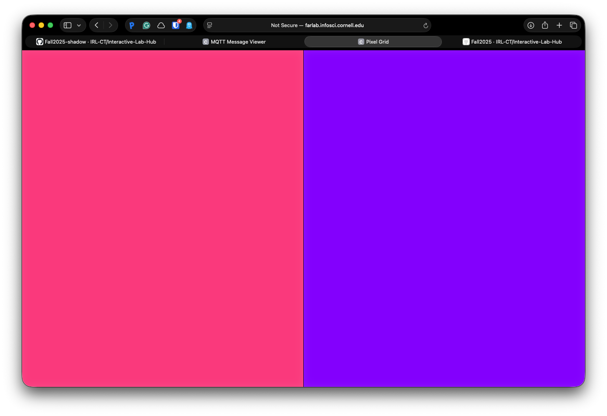
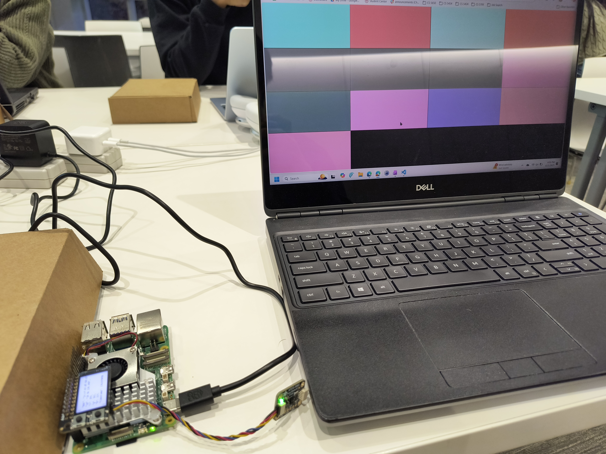
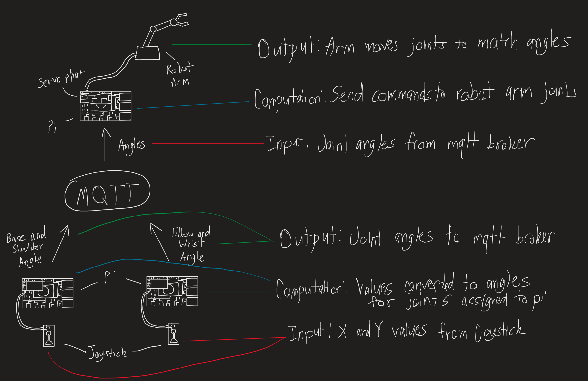
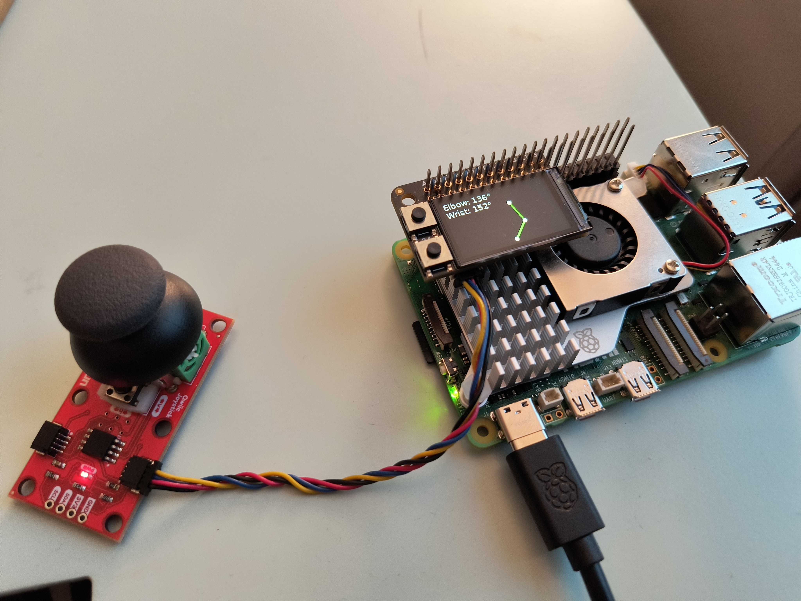
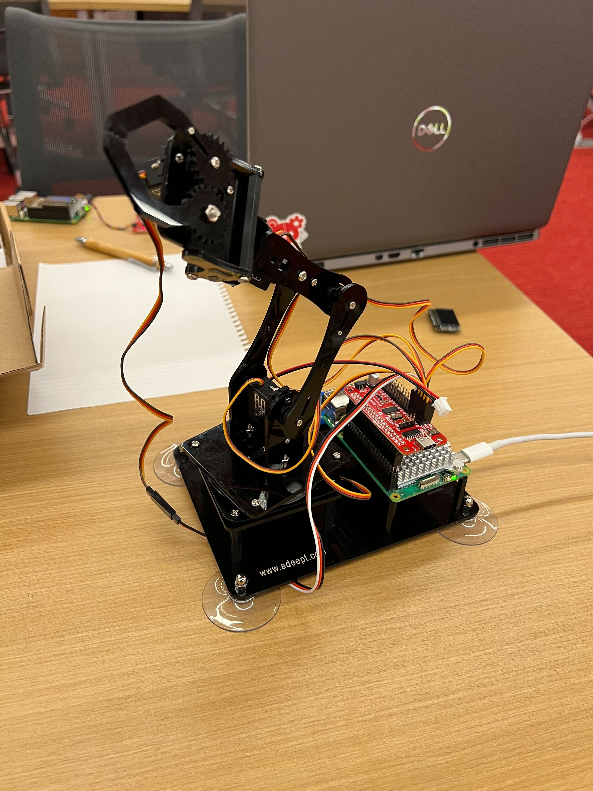
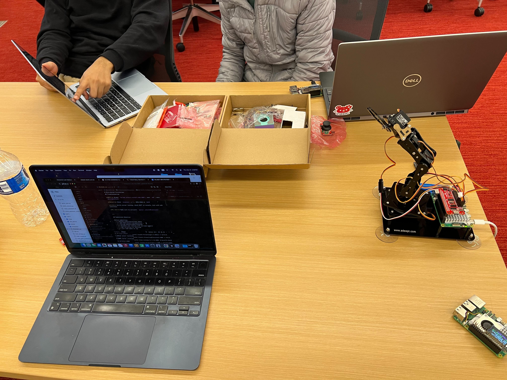
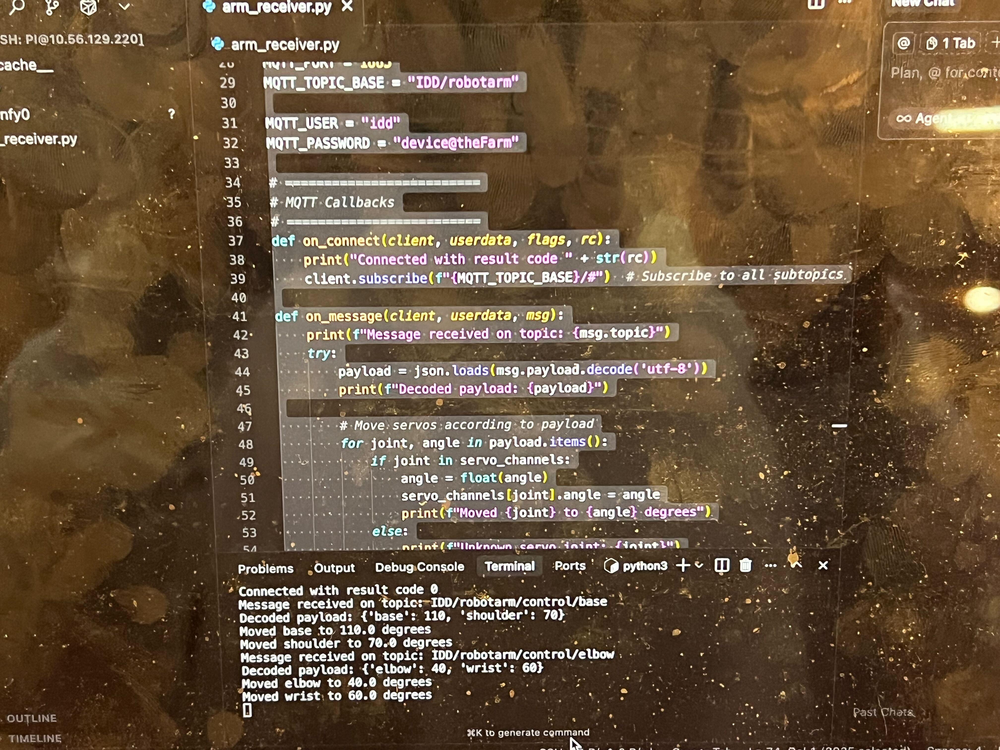

# Distributed Interaction

**NAMES OF COLLABORATORS HERE**

Benthan Vu (bv233)

Akash Basu

Evan Fang

<details>
	<summary><strong>Instructions</strong></summary>
For submission, replace this section with your documentation!

---

## Prep

1. Pull the new changes
2. Read: [The Presence Table](https://dl.acm.org/doi/10.1145/1935701.1935800) ([video](https://vimeo.com/15932020))

## Overview

Build interactive systems where **multiple devices communicate over a network** using MQTT messaging. Work in teams of 3+ with Raspberry Pis.

**Parts:**
- A: Learn MQTT messaging
- B: Try collaborative pixel grid demo  
- C: Build your own distributed system

---

## Part A: MQTT Messaging

MQTT = lightweight messaging for IoT. Publish/subscribe model with central broker.

**Concepts:**
- **Broker**: `farlab.infosci.cornell.edu:1883`
- **Topic**: Like `IDD/bedroom/temperature` (use `#` wildcard)
- **Publish/Subscribe**: Send and receive messages

**Install MQTT tools on your Pi:**
```bash
sudo apt-get update
sudo apt-get install -y mosquitto-clients
```

**Test it:**

**Subscribe to messages (listener):**
```bash
mosquitto_sub -h farlab.infosci.cornell.edu -p 1883 -t 'IDD/#' -u idd -P 'device@theFarm'
```

**Publish a message (sender):**
```bash
mosquitto_pub -h farlab.infosci.cornell.edu -p 1883 -t 'IDD/test/yourname' -m 'Hello!' -u idd -P 'device@theFarm'
```

> **💡 Tips:**
> - Replace `yourname` with your actual name in the topic
> - Use single quotes around the password: `'device@theFarm'`

**🔧 Debug Tool:** View all MQTT messages in real-time at `http://farlab.infosci.cornell.edu:5001`


</details>

**💡 Brainstorm 5 ideas for messaging between devices**

- Chore Confirmation Device
   - A pi in each room chosen by roommates, it has buttons corresponding to each roommate
   - When its a user's turn to clean, they clean the room, press their button, and the roommates come by to check their work and confirm that the roommate cleaned it good enough.
   - These pis can be put in multiple rooms and communicate with each other to keep track of which rooms were cleaned 
      - For example with roommates A, B, C. Roommate A has their turn to clean the bathroom and the kitchen. A clean's the bathroom and presses their button on the device in the bathroom. A is lazy and doesn't clean the kitchen but presses the button. B and C come back and confirm that the bathroom is clean, pressing their associated button. But the kitchen is not clean so they can tell A to clean it.

- Lightswitch Remote
   - The lightswitch in my room in The House is too far from my bed when I lie down, so I have to walk to my bed in the darkness. If there was a way for me to click a button and have it connected to a device next to the light switch that will push it off with like some physical movement, that would be cool.

- Entrance Tracker
   - One pi is placed at an entrance to a door with a proximity sensor. Another pi can have a machine learning model to detect whether a person is entering or leaving. The final pi somewhere else then gets notified if someone is entering or exiting.

- Limb Game
   - A game where the more pis connected, the more limbs are added to a physics based video game character and each pi controls one limb. It could be a simple platformer game.

- Controller Game
   - A game where each pi has a range of values it can produce with a random sensor attached to it. The more pis added, they have to make it so all their values add up to a certain number. 
---

## Part B: Collaborative Pixel Grid

<details>
	<summary><strong>Instructions</strong></summary>
Each Pi = one pixel, controlled by RGB sensor, displayed in real-time grid.

**Architecture:** `Pi (sensor) → MQTT → Server → Web Browser`

**Setup:**

1. **Sensor**

#### Light/Proximity/Gesture sensor (APDS-9960)
We use this sensor [Adafruit APDS-9960](https://www.adafruit.com/product/3595) for this exmaple to detect light (also RGB)
 


Connect it to your pi with Qwiic connector


We need to use the screen to display the color detection, so we need to stop the running piscreen.service to make your screen available again

```bash
# stop the screen service
sudo systemctl stop piscreen.service
```

if you want to restart the screen service
```bash
# start the screen service
sudo systemctl start piscreen.service
```
 
2. **Server** (one person on laptop):
```bash
cd "Lab 6"  
source .venv/bin/activate
pip install -r requirements-server.txt
python app.py
```

2. **View in browser:**
   - Grid: `http://farlab.infosci.cornell.edu:5000`
   - Controller: `http://farlab.infosci.cornell.edu:5000/controller`

3. **Pi publisher** (everyone on their Pi):
```bash
# First time setup - create virtual environment
cd "Lab 6"
python -m venv .venv
source .venv/bin/activate
pip install -r requirements-pi.txt

# Run the publisher
python pixel_grid_publisher.py
```

Hold colored objects near sensor to change your pixel!



</details>

**📸 Include: Screenshot of grid + photo of your Pi setup**




---

## Part C: Make Your Own

<details>
	<summary><strong>Instructions</strong></summary>
**Requirements:**
- 3+ people, 3+ Pis
- Each Pi contributes sensor input via MQTT
- Meaningful or fun interaction

**Ideas:**

**Sensor Fortune Teller**
- Each Pi sends 0-255 from different sensor
- Server generates fortunes from combined values

**Frankenstories**
- Sensor events → story elements (not text!)
- Red = danger, gesture up = climbed, distance <10cm = suddenly

**Distributed Instrument**
- Each Pi = one musical parameter
- Only works together

**Others:** Games, presence display, mood ring

### Deliverables

Replace this README with your documentation:

**1. Project Description**
- What does it do? Why interesting? User experience?

**2. Architecture Diagram**
- Hardware, connections, data flow
- Label input/computation/output

**3. Build Documentation**
- Photos of each Pi + sensors
- MQTT topics used
- Code snippets with explanations

**4. User Testing**
- **Test with 2+ people NOT on your team**
- Photos/video of use
- What did they think before trying?
- What surprised them?
- What would they change?

**5. Reflection**
- What worked well?
- Challenges with distributed interaction?
- How did sensor events work?
- What would you improve?

---

## Code Files

**Server files:**
- `app.py` - Pixel grid server (Flask + WebSocket + MQTT)
- `mqtt_viewer.py` - MQTT message viewer for debugging
- `mqtt_bridge.py` - MQTT → WebSocket bridge
- `requirements-server.txt` - Server dependencies

**Pi files:**
- `pixel_grid_publisher.py` - Example (RGB sensor → MQTT)
- `requirements-pi.txt` - Pi dependencies

**Web interface:**
- `templates/grid.html` - Pixel grid display
- `templates/controller.html` - Color picker
- `templates/mqtt_viewer.html` - Message viewer

---

## Debugging Tools

**MQTT Message Viewer:** `http://farlab.infosci.cornell.edu:5001`
- See all MQTT messages in real-time
- View topics and payloads
- Helpful for debugging your own projects

**Command line:**
```bash
# See all IDD messages
mosquitto_sub -h farlab.infosci.cornell.edu -p 1883 -t "IDD/#" -u idd -P "device@theFarm"
```

---

## Troubleshooting

**MQTT:** Broker `farlab.infosci.cornell.edu:1883`, user `idd`, pass `device@theFarm`

**Sensor:** Check `i2cdetect -y 1`, APDS-9960 at `0x39`

**Grid:** Verify server running, check MQTT in console, test with web controller

**Pi venv:** Make sure to activate: `source .venv/bin/activate`


---

## Submission Checklist

Before submitting:
- [ ] Delete prep/instructions above
- [ ] Add YOUR project documentation
- [ ] Include photos/videos/diagrams  
- [ ] Document user testing with non-team members
- [ ] Add reflection on learnings
- [ ] List team names at top

**Your README = story of what YOU built!**

---

Resources: [MQTT Guide](https://www.hivemq.com/mqtt-essentials/) | [Paho Python](https://www.eclipse.org/paho/index.php?page=clients/python/docs/index.php) | [Flask-SocketIO](https://flask-socketio.readthedocs.io/)

</details>

# Collaborative Robot Arm Control System

**1. Project Description**
## Overview

Our project implements a collaborative robot arm controlled by three Raspberry Pis communicating through the MQTT protocol. The system allows two users to jointly control different parts of a robotic arm to draw an object, while a third participant observes the output and tries to guess what is being drawn in real time. This is interesting because the project combines distributed IoT control, real-time communication, and human collaboration in a creative interactive setup because of the robotic arm.

## Gameplay Concept

- Two players collaborate to draw an assigned object (e.g., a cat, car, or house) by controlling different parts of the robotic arm.
- A third player watches the drawing process and attempts to guess what the object is.
- The interaction fosters teamwork, timing, and communication between the two controllers, highlighting the complexity of distributed human-robot interaction.

## Key Features

- Real-time distributed control across multiple IoT devices
- Multi-user collaborative interaction
- Seamless servo coordination via MQTT messaging
- Creative gameplay that connects engineering with human collaboration


**2. Architecture Diagram**



## Technical Components

### Hardware
- 3× Raspberry Pi 5
- PCA9685 Servo Driver
- 4× Servo Motors
- Shared Wi-Fi Network

### Software
- Python with `paho-mqtt` for message passing
- Adafruit CircuitPython libraries for servo control
- Mosquitto MQTT Broker (`farlab.infosci.cornell.edu`)

**3. Build Documentation**





## Technical Implementation

The system relies on a publisher-subscriber architecture using the Mosquitto MQTT broker. Each controller Raspberry Pi reads user input from a joystick module and converts it into corresponding servo angle values. These values are encoded into JSON messages and published to distinct MQTT topics such as `IDD/robotarm/control/base` and `IDD/robotarm/control/elbow`. The receiver Raspberry Pi continuously subscribes to `IDD/robotarm/#`, listening for all control messages. Upon receiving a message, it parses the JSON payload, identifies which servo group to update, and uses the Adafruit PCA9685 servo driver library to generate the correct PWM signals. The system runs in real time with asynchronous callbacks from the paho-mqtt client, ensuring smooth motion without delay. This modular design allows additional controllers or sensors to be integrated easily, making the architecture scalable for future multi-robot coordination experiments.

## System Architecture

### Raspberry Pi 1 (Controller A)
Handles the base and shoulder servos of the arm. Publishes motion commands (angles) to the shared MQTT topic `IDD/robotarm/control/base`.

### Raspberry Pi 2 (Controller B)
Controls the elbow and wrist servos. Publishes angle updates to `IDD/robotarm/control/elbow`.

### Raspberry Pi 3 (Receiver / Arm Controller)
Subscribes to all subtopics under `IDD/robotarm/#`, decodes incoming JSON messages, and drives the corresponding servos via the PCA9685 motor driver.

## MQTT Communication Flow

- Each controller Pi sends movement commands using `mosquitto_pub` or Python MQTT scripts.
- The receiver Pi runs a Python listener (`arm_receiver.py`) that subscribes to `IDD/robotarm/#`.
- Incoming JSON payloads (e.g., `{"base": 110, "shoulder": 70}`) are parsed and translated into servo movements.
- The robotic arm moves in real time, visualizing the drawing collaboratively generated by both users.


## Code Snippets



#### Joystick
```
x_val = myJoystick.horizontal
y_val = myJoystick.vertical
button_val = myJoystick.button

x_speed = x_val - JOYSTICK_CENTER
y_speed = y_val - JOYSTICK_CENTER

if abs(x_speed) < JOYSTICK_DEADZONE:
   x_speed = 0
if abs(y_speed) < JOYSTICK_DEADZONE:
   y_speed = 0

if x_speed != 0:
   delta_joint1 = x_speed * SENSITIVITY * LOOP_DELAY
   current_joint1_angle += delta_joint1

if y_speed != 0:
   delta_joint2 = y_speed * SENSITIVITY * LOOP_DELAY * 0.25
   current_joint2_angle += delta_joint2
   
current_joint1_angle = max(BASE_SERVO_MIN_ANGLE, min(current_joint1_angle, BASE_SERVO_MAX_ANGLE))
current_joint2_angle = max(SHOULDER_SERVO_MIN_ANGLE, min(current_joint2_angle, SHOULDER_SERVO_MAX_ANGLE))
```

This takes input values from the joystick and converts it to an angle to be sent to the robot arm. It first gets the X and Y components, applies some sensitivity to get the delta angle and changes the stored angle accordingly, then it is sent over mqtt.

```
if (int_joint1 != last_sent_joint1) or \
   (int_joint2 != last_sent_joint2) or \
   (button_val != last_sent_button):
   
   payload_data = {
      "base": int_joint1,
      "shoulder": int_joint2,
      "button": button_val
   }
   json_payload = json.dumps(payload_data)
   
   client.publish(MQTT_TOPIC, json_payload)

   print(f"Sending: Base: {int_joint1}, Shoulder: {int_joint2}")

   last_sent_joint1 = int_joint1
   last_sent_joint2 = int_joint2
   last_sent_button = button_val
```

This code sends angle updates to mqtt when it sees that the joystick has moved. Otherwise it doesn't send anything to avoid spamming the same thing. 

#### Arm Receiver
```
payload = json.loads(msg.payload.decode('utf-8'))
print(f"Decoded payload: {payload}")

for joint, angle in payload.items():
   if joint in servo_channels:
      angle = float(angle)
      servo_channels[joint].angle = angle
      print(f"Moved {joint} to {angle} degrees")
   else:
      print(f"Unknown servo joint: {joint}")
```

This code runs when the pi receives a message from mqtt. It decodes the message and sets the angle of the robot arm accordingly. 

*Click Below image for video - Some footage of development process*

[](https://youtu.be/tgVF1JfRL5A)

**4. User Testing**
- **Test with 2+ people NOT on your team**

*Click Below image for video - User test*

[](https://youtu.be/_g7VPqy51Tw)

The users were pretty surprised when we first explained what they were going to test since they were not expecting a robot arm. What they thought before trying our device was that the idea sounded pretty interesting and fun.

After testing out the device to draw a sad face, they had some feedback. Frank said it would be nice to have more options to control the arm, and that some parts are unclear what they are supposed to do, but otherwise the system works pretty smoothly. Elin (yc2935) said that the screen on the pi is not that useful/intuitive and she just looked at the real arm and tries a direction first to see what gets moved. So overall the users would want to change amount of control over the arm and maybe make the pi screen a bit more accurate to what the arm is doing physically.

**5. Reflection**

Overall what worked well was the pi's being able to send and receive messages from the mqtt broker. However what did not work well was sometimes the pi controlling the robot arm would crash during our user test, so we would have to run the programs again. Also sometimes if we rotated the shoulder joint too much in one direction, it seemed the servo was not strong enough to move it back up, so we just programmed a limit for it. The challenge with distributed interaction for this system is if the robot arm stops responding to inputs, we don't know at first what went wrong, since there were three devices which could be the problem. Like maybe the pi sending joint angles crashed due to losing connection to the joystick, or the pi controlling the robot arm crashing because of an invalid angle. How our sensor events worked were that the two pi controllers each had their own joystick, that would control 2 joints. The X component of the joystick would control the base and elbow joints respectively for each pi, and the Y component similarly would control the shoulder and wrist. These inputs are then converted to angles and sent to the arm pi, which tells the robot arm to move to the angles provided. What we would improve is the robustness of the system to crashes. We need to figure out why rotating the should too much causes a crash, as well as how to make it physically stronger so we don't need to limit its max angle using code.

#### What we worked on
- Benthan: Program to send commands to pi over mqtt, documentation, and video editing
- Evan: Program to receive commands from mqtt and control the robot arm and documentation
- Akash: Getting and building/assembling the robot arm and setting up code to control it, documentation